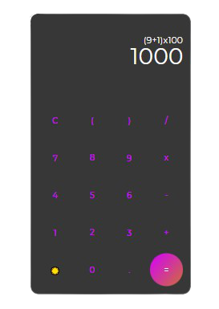
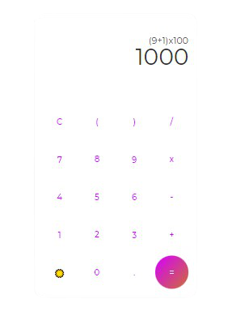

<h1 align="center"> 
    Calculator React JS
</h1>

### :computer: Projeto 

- Aplicação para <b>aprender conceitos simples</b> de React JS.

### :rocket: Tecnologias Utilizadas

- [React JS](https://reactjs.org/)

### :iphone: :heavy_check_mark: Resultado

  
  

